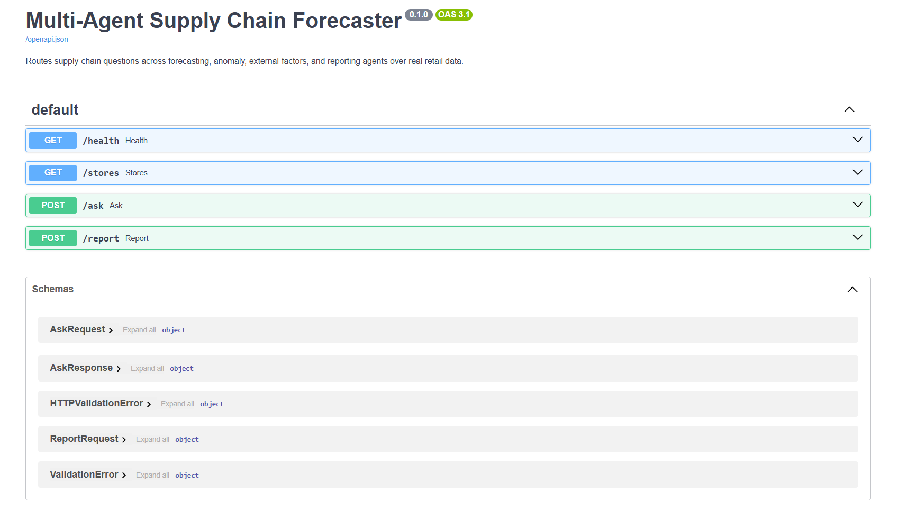
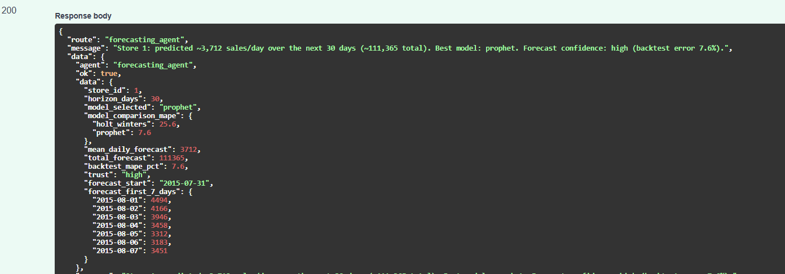
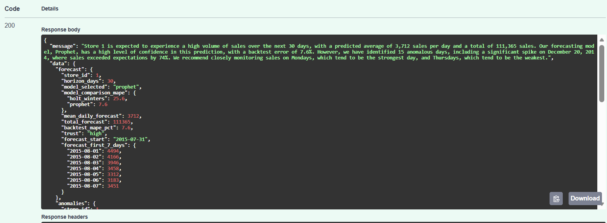

# Multi-Agent Supply Chain Forecaster

A multi-agent system for supply-chain intelligence. A supervisor agent routes
questions across specialized agents — forecasting, anomaly detection,
external-factors, and reporting — over **real retail sales data** (Rossmann
Store Sales: 1,115 stores, daily sales 2013–2015, with promotions and holidays).

The goal: given a natural-language question about a store ("Will store 5 run low
next month?" or "Were there unusual sales days at store 5?"), route it to the
right specialist agent and return a grounded, explained answer with a
confidence signal.

## Demo

The system runs as a FastAPI service with interactive docs. A supervisor routes
each query to the right specialist agent, and a reporting agent composes several
agents into a single briefing.

**Interactive API (`/docs`)** — auto-generated OpenAPI docs for every endpoint:



**`POST /ask`** — a query is routed to the forecasting agent, which benchmarks
Holt-Winters vs Prophet and returns the better model with a confidence signal:



**`POST /report`** — the reporting agent calls the forecasting, anomaly, and
external-factors agents, then synthesizes an actionable briefing:



> *"Store 1 is expected to experience a high volume of sales over the next 30
> days... Prophet has high confidence (7.6% backtest error). However, we
> identified 15 anomalous days, including a spike on December 20, 2014 (+74%).
> We recommend closely monitoring sales on Mondays (strongest) and Thursdays
> (weakest)."*

## Status

| Component | Status |
|---|---|
| Data loader (Rossmann per-store daily series) | ✅ Done |
| **Forecasting agent** — multi-model (Holt-Winters + Prophet), self-backtesting, selects best model by MAPE | ✅ Done |
| **Anomaly-detection agent** — weekday-aware robust z-score (median + MAD), flags spikes/drops | ✅ Done |
| **External-factors agent** — promo lift, holiday effect, weekday patterns from history | ✅ Done |
| **Reporting agent** — calls all specialists and synthesizes an LLM briefing | ✅ Done |
| **Supervisor (LangGraph)** — routes a query to the right agent (LLM classifier + keyword fallback) | ✅ Done |
| **Evaluation harness** — 50 routing cases; keyword router 84% vs LLM router 100% | ✅ Done |
| FastAPI + Docker + CI/CD | ⬜ Planned |
| Cost tracking, security guardrails, MCP server | ⬜ Planned |

## Agents

**Forecasting agent** — predicts future daily sales for a store. Benchmarks
multiple models on held-out data (backtest MAPE) and selects the best one
automatically, so every forecast comes with an expected-error / confidence signal:
- **Holt-Winters** (statsmodels) — exponential smoothing with weekly seasonality; robust baseline
- **Prophet** — additive model with weekly + yearly seasonality and promotions as a regressor

On real data, Prophet typically wins (e.g. ~7.6% MAPE vs ~25% for Holt-Winters on
Store 1), and the agent selects it automatically.

**Anomaly-detection agent** — explains the past by finding unusual sales days.
Uses a **weekday-aware robust z-score** (median + MAD within each day-of-week
group), so it accounts for retail's strong weekly pattern and flags days unusual
*for that weekday*. On real data it automatically surfaces meaningful events —
e.g. the pre-Christmas demand spikes (Dec 18–21, ~+80% vs expected).

**External-factors agent** — explains what drives a store's sales: promotion lift,
holiday effects, and day-of-week patterns computed from its own history.

**Reporting agent** — the synthesizer. Calls the forecasting, anomaly, and
external-factors agents, then combines their outputs into a single actionable
briefing (LLM narrative when a Groq key is configured, clean template otherwise).

All agents share a common `AgentResponse` contract and a `TOOL_SPEC`, so the
supervisor can route to any of them.

## Data

[Rossmann Store Sales](https://www.kaggle.com/competitions/rossmann-store-sales):
1,115 drug stores, daily sales Jan 2013 – Jul 2015, with promotions, state/school
holidays, and store metadata. Real data is not committed; place `train.csv` and
`store.csv` in `./data`.

## Quickstart

```bash
python -m venv venv312 && source venv312/Scripts/activate   # Python 3.12
pip install -r requirements.txt
# place Rossmann train.csv and store.csv in ./data

# run the forecasting agent
python -m src.agents.forecasting_agent

# run the anomaly-detection agent
python -m src.agents.anomaly_agent

# run the SUPERVISOR — routes a natural-language query to the right agent
python -m src.agents.supervisor

# run the reporting agent — full multi-agent briefing
python -m src.agents.reporting_agent

# run the evaluation harness — routing accuracy over 50 cases
python -m src.eval.eval_routing
```

Set `GROQ_API_KEY` to enable LLM-based routing and LLM-written briefings;
without it, the system falls back to keyword routing and template reports so it
still runs fully offline.

## Example — supervisor routing

```
Q: Will store 1 run low on sales next month?
   routed -> forecasting_agent
   Store 1: predicted ~3,712 sales/day over 30 days (~111,365 total).
   Best model: prophet. Confidence: high (backtest error 7.6%).

Q: Were there any unusual sales days at store 1?
   routed -> anomaly_agent
   Store 1: found 15 anomalous days. Most extreme: 2014-12-20
   (spike, 8,367 vs expected ~4,785) — the pre-Christmas surge.
```

## Example — reporting agent (multi-agent synthesis)

```
Supply-chain briefing — Store 1:
Based on a high-confidence Prophet forecast (7.6% backtest error), Store 1 is
expected to see ~111,365 sales over the next 30 days (~3,712/day). We identified
15 anomalous days, including a spike on 2014-12-20 (73% above expected — the
pre-Christmas surge). Promotions lift sales ~23%, and Monday is the strongest
weekday — so stock up on Mondays and hold buffer inventory for seasonal spikes.
```

The reporting agent calls several specialists and synthesizes one briefing — this
is multi-agent *composition*, distinct from the supervisor's *routing*.

## Evaluation

Multi-agent systems have a failure mode single-agent systems don't: the
supervisor can route to the *wrong* agent. The eval harness measures **routing
accuracy** over 50 labeled cases (25 forecasting + 25 anomaly):

| Router | Accuracy |
|---|---|
| Keyword (fast, offline) | 84% |
| LLM (Groq, intent-aware) | 100% |

The eval didn't just score — it **diagnosed the failure**: the keyword router
misroutes anomaly queries containing "demand" (e.g. "detect abnormal demand"),
because "demand" collides with the forecasting keywords. This is exactly why the
LLM router exists — it routes on intent, not keyword overlap — and the harness
quantifies the improvement (84% → 100%).

## Architecture

```
User query
    │
    ▼
Supervisor (LangGraph)  — routes to the right specialist
    │
    ├── Forecasting agent   → predict future demand (multi-model, self-selecting)
    ├── Anomaly agent       → find unusual sales days (weekday-aware robust z-score)
    ├── External-factors    → promo lift / holiday / weekday drivers
    └── Reporting agent     → calls all specialists, synthesizes a briefing
    │
    ▼
Grounded, explained answer + confidence signal
```

## Design notes

- **Empirical model selection** — the forecasting agent backtests and picks by measured error, not by assumption.
- **Weekday-aware anomaly detection** — respects retail's weekly structure; robust statistics (median/MAD) resist outliers.
- **Two orchestration patterns** — the supervisor *routes* to one agent; the reporting agent *composes* several.
- **Graceful failure** — agents validate input (e.g. unknown store) and return a clean response instead of crashing.
- **Swappable LLM** — routing/synthesis use Groq when configured and fall back to offline logic otherwise, so nothing hard-depends on a model being present.

## Tech stack

Python 3.12 · pandas · statsmodels · Prophet · scikit-learn · LangGraph (agent
orchestration) · Groq (LLM routing & synthesis) · FastAPI + Docker + CI (planned)

## Next steps

1. **Wire the reporting agent into the supervisor** — add a "full report" route so the supervisor hands off to composition when the user wants the whole picture.
2. **Extend evaluation** — add answer-quality cases (LLM-as-judge) and harder/ambiguous routing cases.
3. **FastAPI + Docker + CI/CD** — expose `/ask`, `/health`; containerize; GitHub Actions.
4. **AI Ops** — cost dashboard ($/request per agent), model cascading, caching.
5. **Security & guardrails** — input validation, prompt-injection defense, access control.
6. **MCP server** — expose the agents as MCP tools.